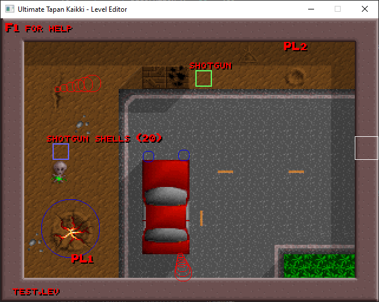

# Level editor for Ultimate Tapan Kaikki (TK321)

Almost feature complete level editor written in Rust for Ultimate Tapan Kaikki (TK321) DOS game classic. See also [opensourced game itself](https://github.com/suomipelit/ultimatetapankaikki).

Editor is heavily based on original DOS era editor but does not aim to be a carbon copy. Hopefully most of the differences can be considered as improvements.

Implementation is done using [SDL2](https://www.libsdl.org/).

## Features

- :heavy_check_mark: Laying wall and floor tiles
- :heavy_check_mark: Level size
- :heavy_check_mark: Saving level
- :heavy_check_mark: Loading level
- :heavy_check_mark: Creating shadows
- :heavy_check_mark: Setting player start positions
- :heavy_check_mark: Spotlights
- :heavy_check_mark: Steams
- :heavy_check_mark: Single player enemies and time limit are configurable
- :heavy_check_mark: Level comment is editable
- :heavy_check_mark: Tile fill feature
- :heavy_check_mark: Automated shadow creation
- :heavy_check_mark: Random crates
- :x::grey_exclamation: Static crate support is read-only
- :x: Level minimap (very niche)

## Improvement considerations

- Proper bitmap font
- Layout tweaks
- Rendering optimizations by reducing texture creation of dynamic values
- More accurate frame rate
- Support for older level files (version < 5)
- Somehow make the options directly referenced in code instead of using workaround indexing
- ...?